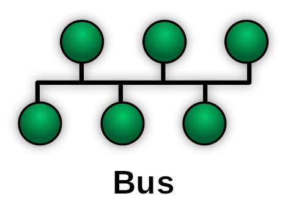
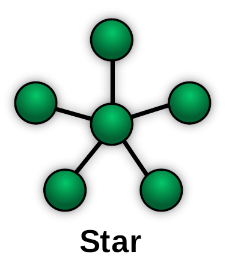
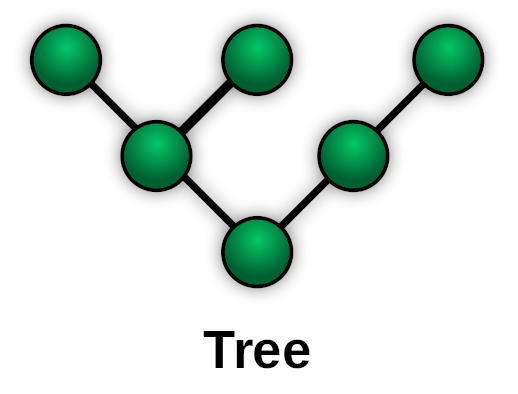

# virtopology
Create a virtualized network within the linux kernel, for the purpose of network education

# Warranty
None! Provided with absolutely no warranty, guarantee, or mormon tea. You you to run this with root, and it has minimal error checking or even testing. It's a bad idea to run this, only do so on an aboslutely disposable machine.

# Tools

newHub.sh       create a namespace with a bridge

newHost.sh      create an empty namespace

hostToHub.sh    create a veth link between two namespaces, one with a bridge

hostToHost.sh   create a point-to-point veth link between 2 namespaces

addService.sh   start a listener in a namespace

# Examples

## Bus Topology

    ./newHub.sh switch # Create a bridging NS
    ./newHost.sh client1
    ./newHost.sh client2
    ./newHost.sh client3
    ./newHost.sh client4
    ./hostToHub.sh client1 eth0 192.168.0.1/24
    ./hostToHub.sh client2 eth0 192.168.0.2/24
    ./hostToHub.sh client3 eth0 192.168.0.3/24
    ./hostToHub.sh client4 eth0 192.168.0.4/24

## Star topology

    ./newHost.sh center
    ./newHost.sh point1
    ./newHost.sh point2
    ./newHost.sh point3
    ./newHost.sh point4
    ./hostToHost.sh client1 192.168.0.2 center 192.168.0.1
    ./hostToHost.sh client2 192.168.0.3 center 192.168.0.1
    ./hostToHost.sh client3 192.168.0.4 center 192.168.0.1
    ./hostToHost.sh client4 192.168.0.5 center 192.168.0.1

## Tree Topology

    ./newHost.sh root
    ./newHost.sh layer1_1
    ./newHost.sh layer1_2

    ./hostToHost.sh root 10.0.0.1 layer1_1 10.1.0.1
    ./hostToHost.sh root 10.0.0.1 layer1_2 10.1.0.2
    
    ./newHost.sh layer2_1
    ./newHost.sh layer2_2
    ./newHost.sh layer2_3

    ./hostToHost.sh layer1_1 10.1.0.1 layer2_1 10.2.0.1
    ./hostToHost.sh layer1_1 10.1.0.1 layer2_2 10.2.0.2
    ./hostToHost.sh layer1_2 10.1.0.2 layer2_3 10.2.1.1